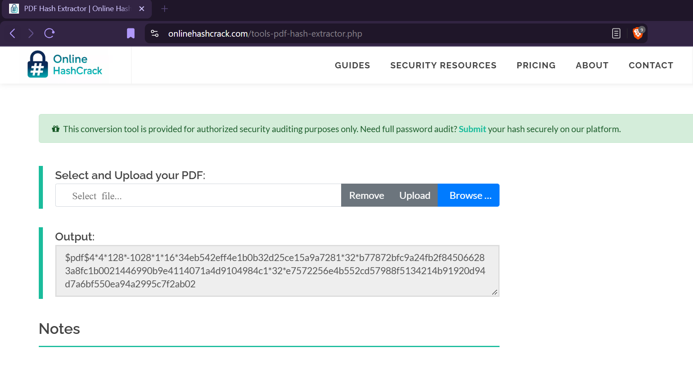
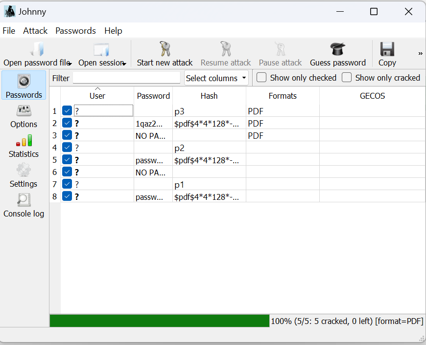
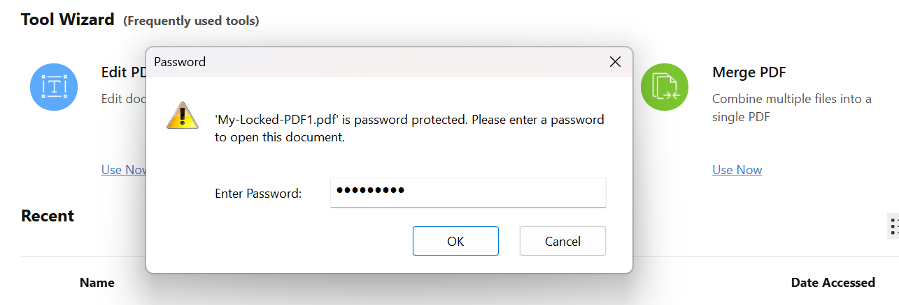
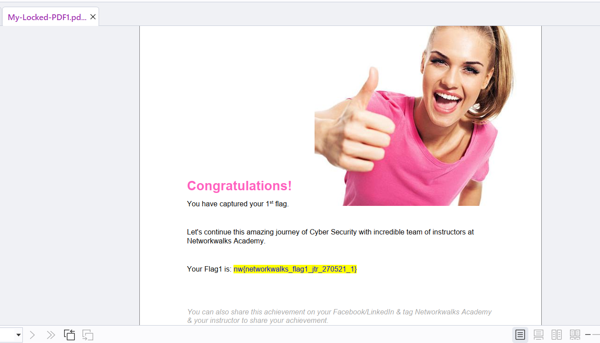
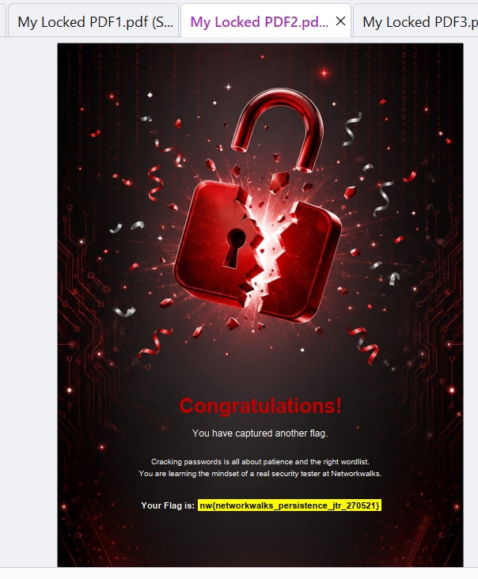
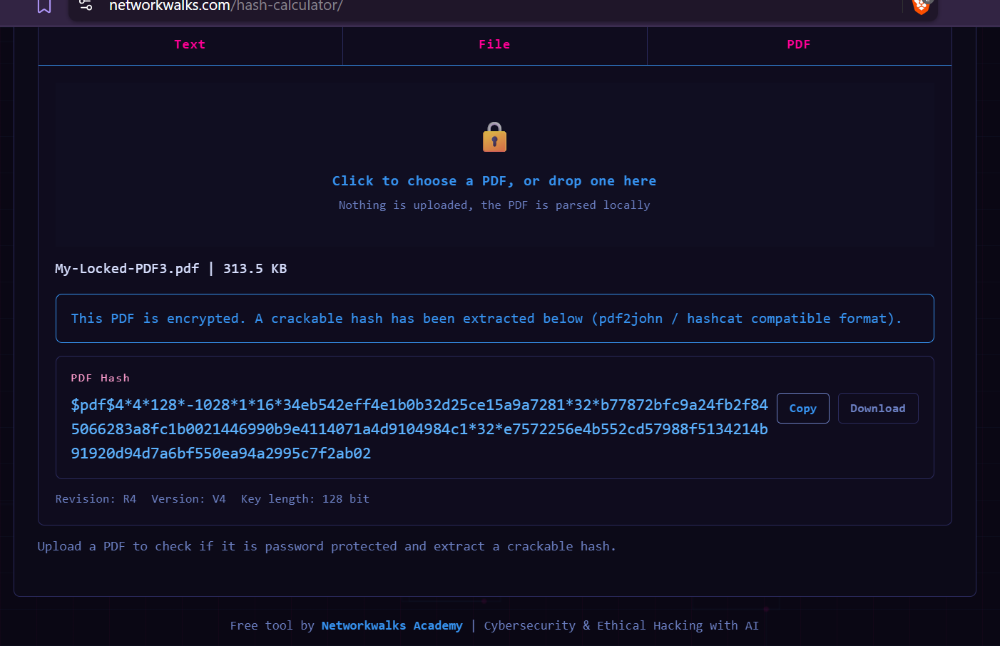
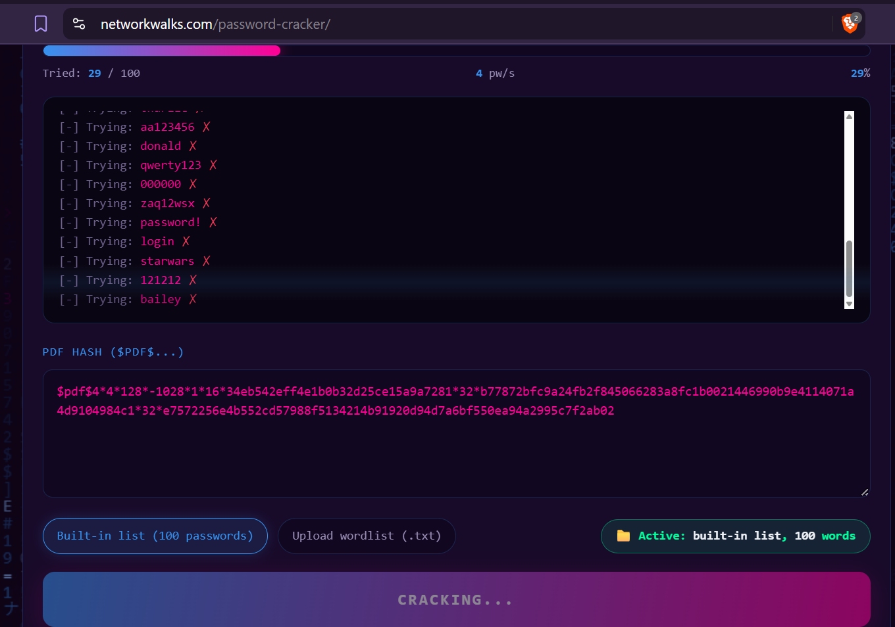
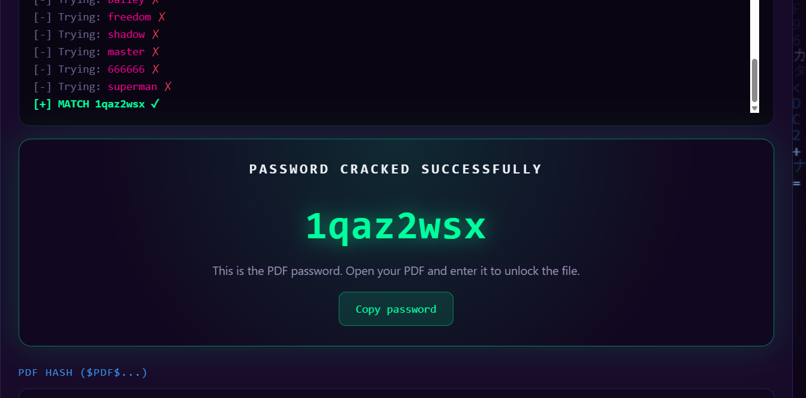
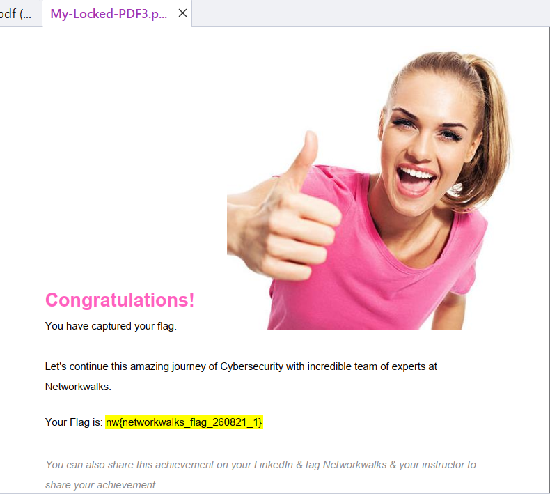

# NETWORKWALKS-B083-WK3-PM1_2-CYBERSECURITY-PASSWORD-CRACKING
**Password cracking for pdf files**

This repository contains my Week 3 practical work completed as part of my Cybersecurity & Ethical Hacking Internship at Networkwalks.

# Overview
On Week 3 we focused on 2 key areas of cybersecurity Password Cracking:

#### - Getting File Hash
#### - Using Hash to get Password

# Objectives
The objectives of this project are to be able to unlock the 3 PDF files that are password protected, in order to gain the data/information contained in them. 

# Activities
## Task 1:
**1. Getting File Hash: onlinehashcrack.com - PDF hash Extractor**\
I used this online system to get the hash of each file. On the system I uploaded the each locked pdf file and generated the hash key. After the key was generated, I copied and saved it and saved it to a text file.

**2. Using Hash to get Password: John the Ripper**\
After the successful installation and config of Johnny, I uploaded the the text and started the process of cracking (attack). It processed and after it was done, the password was generated. 

I copied the password, opened the locked PDF file, pasted the password on the password field and unlocked the document.

The content of the file was visible and accessable, mission completed.

PDF2

## Task 2:
**1. Getting File Hash: networkwalks.com - Hash Calculator**\
I used this online system to get the hash of each file. On the system I uploaded the each locked pdf file and generated the hash key. After the key was generated, I copied it to clipboard.

**2. Using Hash to get Password: networkwalks.com - Password Cracker**\
After the copying on the clipboard, I switched to this system, pasted the copied hash key and started the process of cracking (attack). 

It processed and after it was done, the password was generated. 

I copied the password, opened the locked PDF file, pasted the password on the password field and unlocked the document.
The content of the file was visible and accessable, mission completed.

## Tools Used
|Tool	|Purpose|
| ----|-------|
| onlinehashcrack.com - PDF hash Extractor | To generate the hash key of the pdf file |
| John the Ripper | To read the hashed key and convert it to readable password |
| networkwalks.com - Hash Calculator | To generate the hash key of the pdf file |
| networkwalks.com - Password Cracker | To read the hashed key and match it with the a password on the passwordlist |

## Authorization & Ethical Use
The contents of this repository are provided strictly for educational, research, and authorized cybersecurity training purposes.

# Author
**Sikhanyiso B. Sibisi**
Cybersecurity Intern - B083

LinkedIn: https://za.linkedin.com/in/sikhanyiso-b-s-a28a0b13a

# Project Information
GitHub | Repository|
-------|-----------|
Program Name| Cybersecurity at Networkwalks |
Project | Cybersecurity - Password Cracking | 
Instructor | Waqas Karim |
Week | 03 | 
