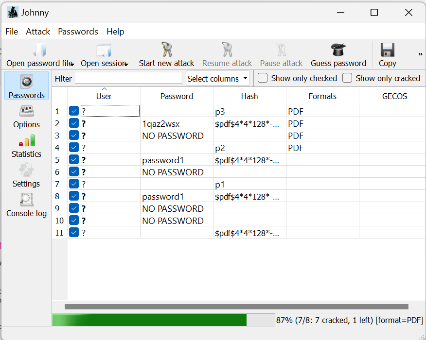
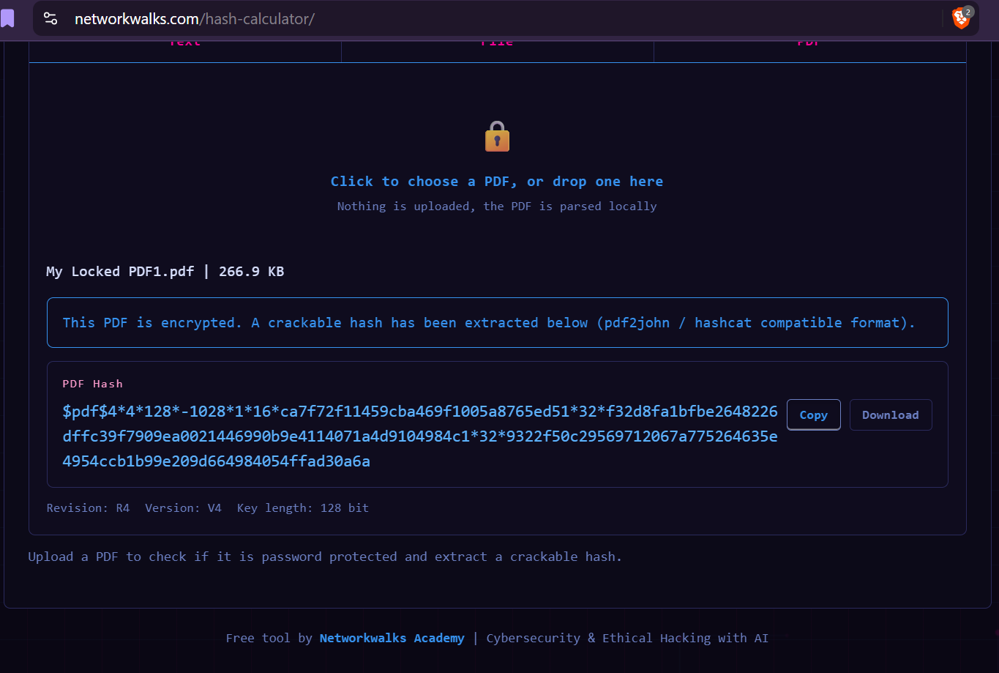
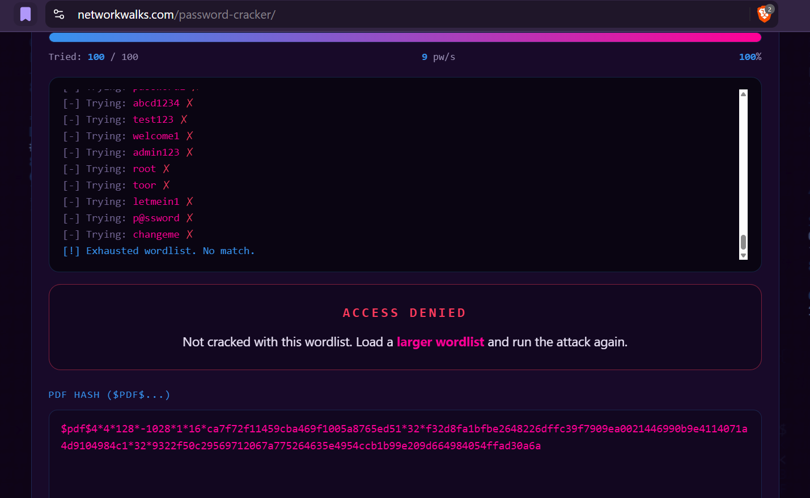

# NETWORKWALKS-B083-WK3-PM1_2-CYBERSECURITY-PASSWORD-CRACKING

**Password-protected PDF security assessment**

This repository documents my Week 3 practical project completed as part of my Cybersecurity & Ethical Hacking Internship at Networkwalks. The exercise focused on understanding how password-protected PDF documents can be assessed through authorized offline password-recovery techniques.

## Overview

Password-protected documents are designed to prevent unauthorized access. From a cybersecurity perspective, however, they can be examined and assessed to understand how the protection mechanism works, how password-derived authentication data is stored, and how recoverable a password may be under controlled testing conditions.

This practical covered two key workflows:

- Extracting PDF authentication data and using John the Ripper for password recovery
- Generating a PDF hash using the Networkwalks platform and testing it against a password list

The project demonstrates the relationship between password protection, password strength, hashes, wordlists, and recovery tools.

## Objectives

The objectives of this project were to:

- Understand the role of password protection in PDF documents
- Learn the difference between a password and the authentication data used to verify it
- Extract the hash or equivalent authentication data from protected PDF files
- Use John the Ripper in an authorized password-recovery exercise
- Use the Networkwalks training platform to perform a second recovery workflow
- Verify recovered passwords by opening the protected documents
- Document the steps, tools, and learning outcomes professionally and ethically

## Practical Activities

### Task 1: PDF Authentication-Data Extraction and Password Recovery

#### Step 1: Extract the PDF authentication data

I used the OnlineHashCrack PDF Hash Extractor to generate the hash for each protected PDF. The extracted data was saved to a text file for use during the password-recovery stage.

> Security note: Uploading real files to third-party services should only be done when explicitly authorized and when the risks are understood. For professional work, prefer local or controlled lab environments when possible.

#### Step 2: Password recovery with John the Ripper

The saved authentication data was then provided to John the Ripper. The tool tested candidate passwords against the extracted value until a matching password was found.

After the password was recovered, it was entered into the PDF viewer and the document was successfully opened.

The content of the file was then visible and accessible.

The same workflow was then applied to a second protected PDF.

### Task 2: Networkwalks Hash Calculator and Password Cracker

#### Step 1: Generate the hash

For the second workflow, the protected PDF was processed using the Networkwalks Hash Calculator. The generated value was copied and used in the recovery stage.

#### Step 2: Password recovery

The calculated hash value was pasted into the Networkwalks Password Cracker and the recovery process began.

The initial attempt did not return a result, so an additional password list was uploaded. After testing a larger candidate list, the password was recovered successfully.

The recovered password was then used to unlock the protected PDF.

## Results Summary

| File | Authentication Data Extracted | Recovery Method | Result |
|------|-------------------------------|-----------------|--------|
| PDF 3 | Yes | John the Ripper | Successfully recovered |
| PDF 2 | Yes | John the Ripper | Successfully recovered |
| PDF 1 | Yes | Networkwalks Password Cracker | Successfully recovered |

This practical demonstrated that password-protected documents can be vulnerable to offline password guessing when the underlying password is weak, predictable, or present in a candidate wordlist.

## Tools Used

| Tool | Purpose |
|------|---------|
| Windows 11 | Install and run John the Ripper |
| OnlineHashCrack PDF Hash Extractor | Extract the PDF authentication data |
| John the Ripper | Test candidate passwords against the extracted value |
| Networkwalks Hash Calculator | Generate the PDF hash for the training workflow |
| Networkwalks Password Cracker | Match the hash against a password list |

## Key Cybersecurity Concepts

- Password hashing and verification
- The distinction between a password and the derived authentication data used to validate it
- Offline recovery vs. online login attempts
- Wordlists, password patterns, and guessing strategies
- Why password strength matters for document security

### Important technical clarification

John the Ripper does not simply "convert a hash into a readable password." In practice, it tests candidate passwords against the extracted authentication data until a password is found that verifies successfully. This distinction is important for accurate cybersecurity documentation.

## Ethical and Legal Use

This repository is intended strictly for educational, research, and authorized cybersecurity training purposes.

Password-recovery techniques must only be used against:

- Files you own
- Lab files provided for training
- Systems where you have explicit authorization
- Data covered by an approved security assessment

Do not use these techniques to access another person's files, accounts, systems, or data without permission.

## Lessons Learned

This practical helped me understand:

- How password-protected PDFs can be assessed from a security perspective
- The importance of password strength and unpredictability
- How hashes and password-derived verification values are used in authentication systems
- How wordlists and recovery strategy affect the likelihood of success
- Why professional security work must be reproducible, ethical, and well documented

## References

- John the Ripper — Official Website
- John the Ripper Documentation
- John the Ripper Usage Examples
- John the Ripper Cracking Modes
- Networkwalks Hash Calculator
- Networkwalks Password Cracker

## Author

**Sikhanyiso B. Sibisi**  
Cybersecurity Intern - B083

LinkedIn: https://za.linkedin.com/in/sikhanyiso-b-s-a28a0b13a

## Project Information

| Field | Value |
|-------|-------|
| Program Name | Cybersecurity at Networkwalks |
| Project | Cybersecurity - Password Cracking |
| Instructor | Waqas Karim |
| Week | 03 |

## Conclusion

This practical demonstrated the workflow involved in an authorized password-security assessment of protected PDF documents. It showed how authentication data can be extracted, supplied to a password-recovery tool, and tested using controlled password-guessing techniques. More importantly, it reinforced the defensive lesson behind password cracking: password protection is only as strong as the password practices and cryptographic protections behind it.

